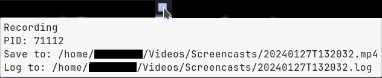
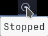

# waybar-screenrecorder

waybar module to record your screen.





# Requirements


Requires [wf-recorder](https://github.com/ammen99/wf-recorder).

# Installation

```
git clone https://github.com/raffaem/waybar-screenrecorder $HOME/.config/waybar/waybar-screenrecorder
```

Put the following in `$HOME/.config/waybar/config`:

```
"custom/screenrecorder": {
    "exec": "$HOME/.config/waybar/waybar-screenrecorder/screenrecorder status",
    "interval": "once",
    "signal": 1,
    "return-type": "json",
    "tooltip": true,
    "format": "{}",
    "on-click": "$HOME/.config/waybar/waybar-screenrecorder/screenrecorder toggle fullscreen",
    "on-click-right": "$HOME/.config/waybar/waybar-screenrecorder/screenrecorder toggle region"
},
```

